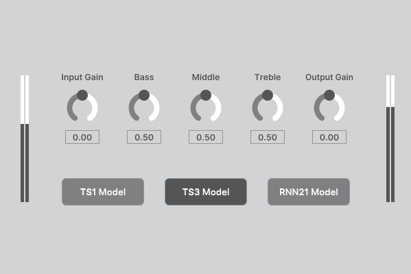

# Neural Grey-Box Guitar Amplifier Modelling with Limited Data
This repository contains supplementary material for the DAFx23 paper [Neural Grey-Box Guitar Amplifier Modelling with Limited Data](/).

### Abstract
This paper combines recurrent neural networks (RNNs) with the discretised Kirchhoff nodal analysis (DK-method) to create a grey-box guitar amplifier model. Both the objective and subjective results suggest that the proposed model is able to outperform a baseline black-box RNN model in the task of modelling a guitar amplifier, including realistically recreating the behaviour of the amplifier equaliser circuit, whilst requiring significantly less training data. Furthermore, we adapt the linear part of the DK-method in a deep learning scenario to derive multiple state-space filters simultaneously. We frequency sample the filter transfer functions in parallel and perform frequency domain filtering to considerably reduce the required training times compared to recursive state-space filtering. This study shows that it is a powerful idea to separately model the linear and nonlinear parts of a guitar amplifier using supervised learning.

### Resources
- [Dataset](https://zenodo.org/record/7970723)
- [Listening page](https://stepanmk.github.io/grey-box-amp/)

### Real-time version

<a href="https://github.com/stepanmk/grey-box-amp/tree/master/plugin" align="center">
    
</a>

The ```plugin``` directory contains the source code for the real-time version of the models presented in this work. The VST3 version compiled on Windows is located in the ```plugin/windows_build``` folder. The plugin enables switching between the proposed models (denoted as TS) trained on 4 and 12 minutes of data. The third model (RNN21) is a fully black-box conditioned LSTM model trained on 84 minutes of data.

#### Note that the plugin only works properly at a sampling rate of 44.1 kHz.

### BibTeX reference

```
@inproceedings{miklanek2023greybox,
    title={Neural Grey-Box Guitar Amplifier Modelling with Limited Data},
    author={Š. Miklánek and A. Wright and V. Välimäki and J. Schimmel},
    booktitle = {Proc. Int. Conf. Digital Audio Effects (DAFx-23)},
    year = {2023},
    address = {Copenhagen, Denmark}, 
    month = {Sep.}
}
```